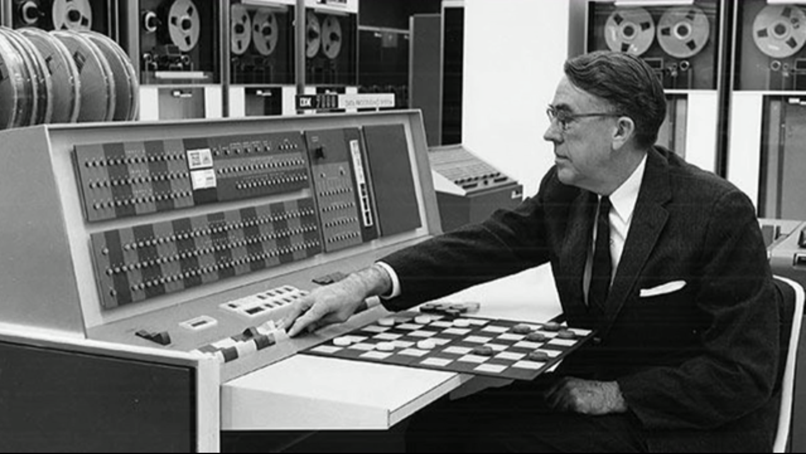
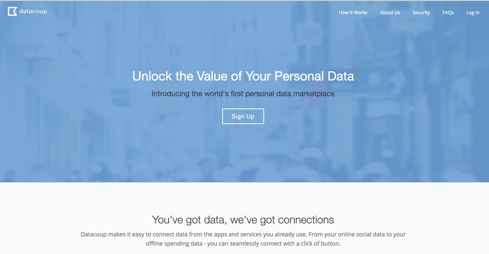
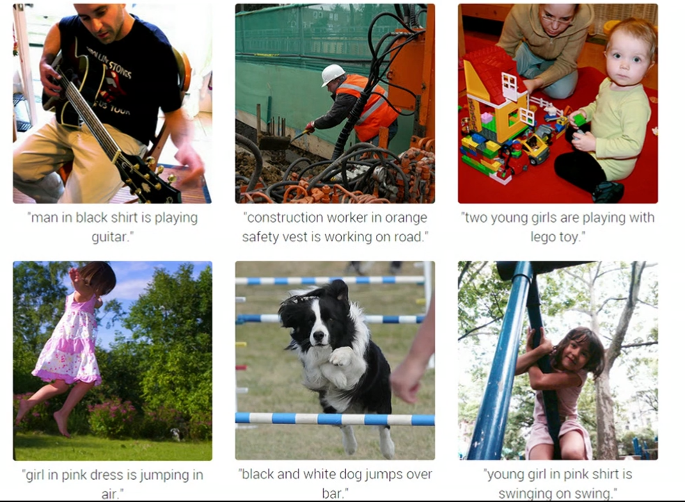
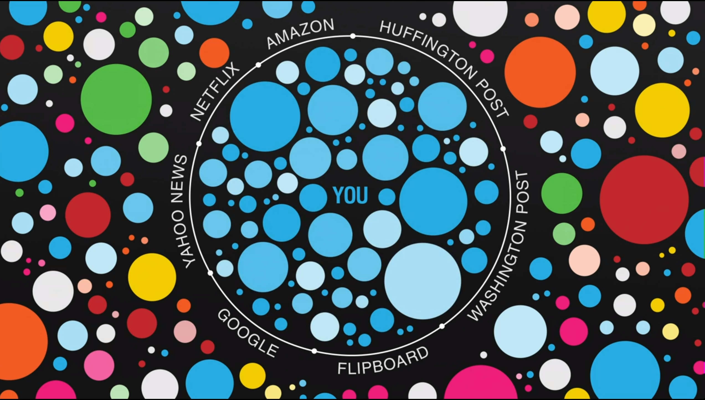
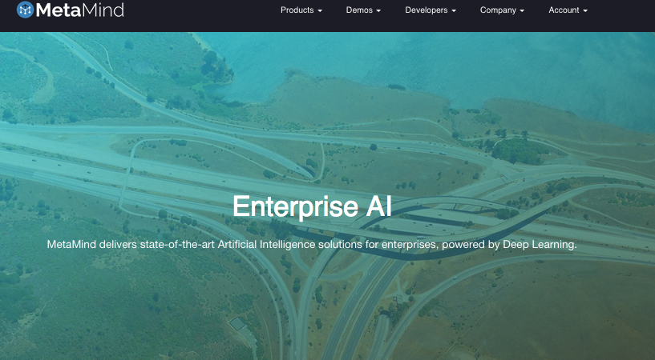
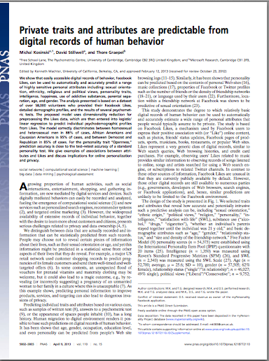
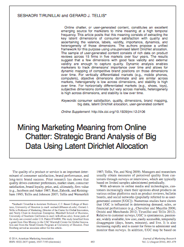
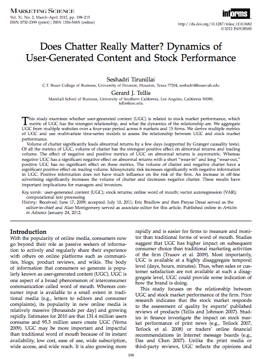

## Notes

* Ask!
* Slides & code are available at [on GitHub]( http://good-marketing.github.io/marketing_lecture_uva)

--- &twocol

## About Me / Oxyme

*** =left

### 2002 Consultancy
### 2005 PhD (VU)
### 2007 Oxyme
### 2015 Good Marketing

*** =right

### Age: 36 years
### Passion: Science
### Sport: Sailing & Running
### Drink: G&T

---

## About Oxyme

<iframe src="https://player.vimeo.com/video/17892944?color=c4d127&title=0&byline=0&portrait=0" width="100%" height="90%" frameborder="0" webkitallowfullscreen mozallowfullscreen allowfullscreen></iframe>

--- &radio
## What is Google?

1. A search engine
2. A ad platform
3. Big Brother
4. _Something different altogether_

*** .hint
It's not a search engine.

*** .explanation
It's not an ad platform

--- &twocol

## Outline for Today

### The objective

*** =left

### Part 1

From *data* to insights: practice

* The question
* Applications
* Data
* Methodology 
* Visual analysis : An live experiment

*** =right

### Part 2

From data to *insights*: science

* Transactional data : Private traits and attributes are predictable from digital records of human behavior
* Expressed data : Mining Marketing Meaning from Online Chatter: Strategic Brand Analysis of Big Data Using Latent Dirichlet Allocation.

---

## My objective for today

<iframe width="100%" height="100%" src="https://www.youtube.com/embed/SdkdQtlF-RU" frameborder="0" allowfullscreen></iframe>

---

## Start with the guess

<iframe width="100%" height="500" src="https://www.youtube.com/embed/b240PGCMwV0" frameborder="0" allowfullscreen></iframe>

Richard Feynman

---

## Ockam's Razor

 > "Among competing hypotheses that predict equally well, the one with the fewest assumptions should be selected."

William of Ockham (c. 1287–1347)

| Paper                                                                                     | Data                                                                                    | Method                             | Insight                                                                                 | Source                                                              |
|-------------------------------------------------------------------------------------------|-----------------------------------------------------------------------------------------|------------------------------------|-----------------------------------------------------------------------------------------|---------------------------------------------------------------------|
| Pioneering advantage: Marketing logic or marketing legend (1993)                          | Hard copies of Business week, Advertising Age of 50 product categories + PIMS database. | Historical Analysis                | Being first to market does not result in long term advantages for the pioneer.         |        [paper](http://www-bcf.usc.edu/~tellis/pioneering.pdf)                                                             |
| Managing the Future: Ceo attention and innovation outcomes. (2007)                        | Letters to shareholders  + Wayback Machine                                              | Hazard Model                       | Frequency of the word will, predicts the time to adoption of an innovation (e-banking). | [paper](http://assets.csom.umn.edu/assets/84471.pdf)                |
| The Future of Prediction: How Google Searches Foreshadow Housing Prices and Sales. (2012) | Google search frequencies  + San Francisco Real estate data                             | Seasonal autoregressive (AR) model | Search terms are correlated with future sales and prices in the housing market.         | [paper](http://papers.ssrn.com/sol3/papers.cfm?abstract_id=2022293) |

--- &twocol

## On data and exponential growth

*** =right

*** =left

### The goldilocks conditions  data

1. Data availability (two reasons).
2. Exponential increase in cheap, easy to deploy, distributed computing power & storage.
3. Productivity tools.

*** =right

--- &twocol

*** =right

[Bill Moorier](http://abstractnonsense.com/mri/)

*** =left

## We are wired to share

> "Humans so willingly self-disclose because doing so represents an
event with intrinsic value, in the same way as with primary rewards
such as food and sex." 

[Tamir & Mitchell 2012](http://wjh.harvard.edu/~dtamir/Tamir-PNAS-2012.pdf)

--- &twocol

*** =right

*** =left

## Everything is 0's and 1's

> Software is eating the world. 

[Marc Andreesen](http://www.wsj.com/articles/SB10001424053111903480904576512250915629460)

--- 

##  Applications: what to do with this data?

---
## Consumer Health

---
## Law

[Link](https://lexmachina.com/)

--- &twocol

## Literature

*** =left

Extraction of 6 archetypes stories based on 40K novels.

[Matthew Jonkers](http://www.matthewjockers.net/2015/02/25/the-rest-of-the-story/)

*** =right

Novel written by an algorithm in 72 hours. (2008)
[Link](http://www.sptimes.ru/story/24786)

---

## Finance  / InvestMent

Business plan evaluation

[Link](http://growthsci.com/)

---
## Healtcare

--- &twocol

## PR

*** =left

Let's try NYT [Link](http://www.nytimes.com/interactive/2015/03/08/opinion/sunday/algorithm-human-quiz.html?action=click&contentCollection=Opinion&module=RelatedCoverage&region=Marginalia&pgtype=article&_r=0)

*** =right

--- &twocol

## Applications in Marketing

*** =left

### Upstream

* Product Innovation (incremental)
* Ideation

### DownStream

* Campaign evaluation
* Communication
* Brand Health

*** =right

--- &twocol

*** =left

## In Summary on data

### The Good

* It's there and it's growing.
* The econometrics best friend : TIMESTAMP
* Agent based data
 
  

### The Bad

* Data ownership / authorship
* Single source (Gnip, Twitter)

*** =right

-
Prof. Sandy Pentland
[link](http://edge.org/conversation/reinventing-society-in-the-wake-of-big-data)

--- &twocol

*** =right

##  On modelling

> "Essentially, all models are wrong, but some are useful."

George Box

*** =left

## Two problems

1. Do I have the right data ? (Define inclusion criteria)
2. How well is my classification model (topics,sentiment,mortality etc) performing?

## Methodology challenges

0. Training or no Training
1. Dimsensionality Reduction
2. Dimensionality Interpretation
3. Validation

--- &twocol

*** =right

## What we did, analysing sentiment

1. Go for data quality, not quantity
2. Use human interpretation
3. Use established sampling methodologies
4. Check quality, rinse and repeat

*** =left

## How to analyse?

0. Deinstall Excel, it's the devil's instrument

1. Go back to the question
2. Ockam's Razor
3. Assess your data needs
4. Select appropriate methodology based on properties of the data
5. Run the code
6. Make your research reproducible (R,Python,Julia,Go,Java,Ruby,Matlab...something)

--- &twocol

## The start of machine learning

*** =right

[Arthur Samuel](http://en.wikipedia.org/wiki/Arthur_Samuel)

*** =left

* 1960: Teach the computer how to play by encoding the rules.
* 2015: The computer learns what rules are by itself.

--- &twocol

*** =left

## Modelling and data

> "The data is the model. The worst algorithm beats the best algorithm when the size of the dataset is dramatically increased."

Peter Norvig
Director of Research @ Google
[paper](http://machinelearningmastery.com/hands-on-big-data-by-peter-norvig/)

*** =right

---

## Data is the (business) model

--- &twocol

## How good is are the (deep learning) algorithms?

*** =right

### Reverse engineer Google images

*** =left

### Google putting youtube data to work.

--- &twocol

*** =left

## Beware of the Filter bubble

[Ted Talk](https://embed-ssl.ted.com/talks/eli_pariser_beware_online_filter_bubbles.html)

*** =right

### Algorithms

* Google uses 57 parameters to determine what search results to display
* Facebook experiments emotional contagoin [paper](http://www.pnas.org/content/111/24/8788.full.pdf)

### Deployment

* Amazon is on record as making changes to production every 11.6 seconds on average in May of 2011.  
* Facebook releases to production twice a day.

--- &twocol

## Decoupling of application and understanding

*** =left

*** =right

[Tim Salimans](http://timsalimans.com/about/)
Ph.D. candidate in econometrics at Erasmus University Rotterdam in the Netherlands.

--- &twocol

## A demonstration of decoupling

*** =right

### MetaMind.io Api

*** =left

### Two examples

1. Twitter sentiment [link](https://www.metamind.io/language/twitter)
2. Our hummer classification [link](http://127.0.0.1:8500/Apps/InstaGram/)

* How to train the model
* Assessing the quality
* What to do with the outcome

--- &twocol

*** =left

## In Summary on Methodology

1. More data = better outcome
2. Algortihms are getting better fast
3. Decoupling of algorithm writers and users
4. Beware of the filter bubble
5. Where will it end....?

*** =right

How can the net amount of entropy of the universe be massively decreased?

Isaac Asimov: The Last Question 
[Link](http://www.multivax.com/last_question.html)

--- &twocol

## Break: 5 min

--- &twocol

*** =left

## What can be predicted from your likes?

> Private traits and attributes are predictable from digital records of human behaviour.

Michal Kosinskia,1, David Stillwella, and Thore Graepelb

*** =right

--- &twocol

## You are what you like?

*** =left

### Dependent variables

* Sexe
* Political orientation
* Sexual orientation
* Ethnicity
* Personality Traits

*** =right

### The Big Five model of personality

---

## Data

* My personality project (app on Facebook)
* 52K Personality surveys
* 1.3K Intelligence surveys
* 2.3K Satisfaction with Life surveys
* 58K Facebook profiles (gender ,political view,religion)

---

## Methodology

--- &twocol

## Insights

*** =left

### Accuracy of the model

*** =right

### Predictors

[All results](http://www.pnas.org/content/suppl/2013/03/07/1218772110.DCSupplemental/st01.pdf)

--- &twocol

## Who dares....

*** =left

*** =right

[Link](http://applymagicsauce.com/)

---&twocol

## Make sense of all this data about your brand

*** =left

> Mining Marketing Meaning from Online Chatter: Strategic Brand Analysis of Big Data Using Latent Dirichlet Allocation

SESHADRI TIRUNILLAI and GERARD J. TELLIS

*** =right

--- &twocol

*** =left

## Data

0. How did they search (inclusion criteria, e.g. Micheal Dell) ?

1. 350K **product** review ratings in 5 categories

*** =right

---

## Methodology

1. Unsupervised learning

2. Interpretable dimensions

3. Context specific word us (polysemy)

4. Provides data on dimension reduction

---

## Validity

1. Human raters [0.6 interrated reliability]

2. Consumer Reports

3. Hetrogeneity (Herfindahl index)

4. Split sample tests (why such a high level of aggregation).

---

## Application

1. Brand Mapping
   (Create a similarity measure based on the top word distributions across brand within a market). 

2. Dynamic Brand Evaluation

3. An example [Link](http://cpsievert.github.io/LDAvis/reviews/vis/#topic=3&lambda=0.6&term=cop)

---

## Limitations

1. Focus on perceived quality. what about the other drivers (social, marketing induced, transactional, service)

2. Assertion is that consumer focus on the most important dimensions if quality.  != True

3. Dimension selection & Labeling dimensions

4. Words convey partial information.

5. Attribution (is about you, the competition, retailer, service organisation)?

6. LDA over time is difficult, dimensions are context specific and will shift.

---

## What is the advantage?

### Ockam's razor

* The paper is really about product analysis aggregated to a brand level.
* 0.6 overlap in human raters
* 0.61 to 0.81 overlap with consumer reports

--- &twocol

## Closing statements

*** =left

### On data and applications

* The era of coveillence (sharing & tracking) is here.
* Data and algoritms will make, predictability data property
* We have some interesting issues (filter bubble, ownership) ahead

*** =right

### On the papers

* Social data is a predictor of offline phenomenon
* Methodologies need careful evaluation and attention, think of Ockam's Razor
* The world is your oyster; if you are an econometrist

--- &twocol

*** =left

## Final Thoughts

> How far will we share, when are we going to stop sharing, and how far are we going to allow ourselves to monitor and surveil each other in kind of a coveillance? 

*** =right

-
Kevin Kelly

---

## What is Google?

> Kevin meets Larry Page in 2002
 
> "Larry, I still don't get it. There are so many search companies. Web search, for free? Where does that get you?” My unimaginative blindness is solid evidence that predicting is hard, especially about the future, but in my defense this was before Google had ramped up its ad-auction scheme to generate real income, long before YouTube or any other major acquisitions. I was not the only avid user of its search site who thought it would not last long. But Page's reply has always stuck with me:" 

 

<h2>"Oh, we're really making an AI."</h2>

---

## Blue Pill or Red Pill

<iframe width="100%" height="90%" src="https://www.youtube.com/embed/RhlXqYiTz2Q" frameborder="0" allowfullscreen></iframe>

